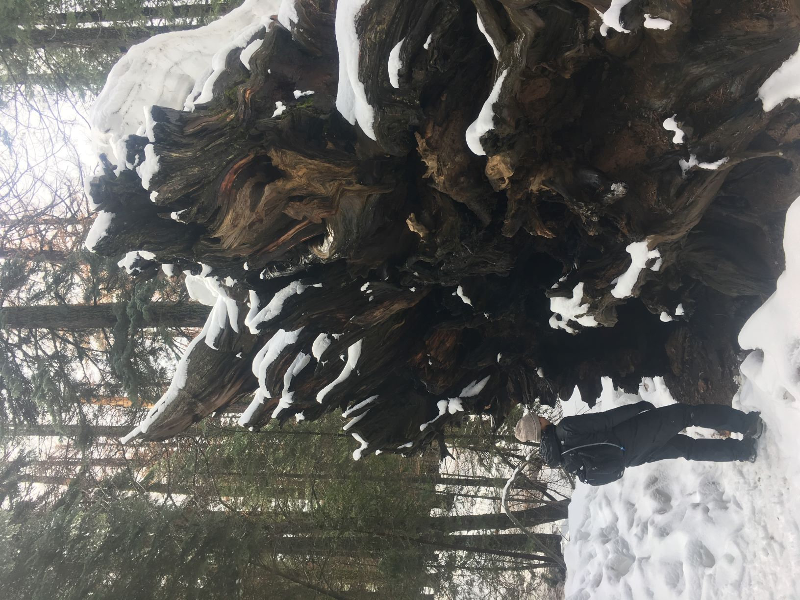

## Welcome to my Github Landing Page!

This is a work in progress, be sure to check back as things get updated.

#### What I'm working on right now: 

Degree: M.S. Statistics at Oregon State University

Project: Analysis of Alaska Fisheries Science Center (AFSC) Resource and Conservation Engineering Division (RACE) Eastern Bering Sea Continental Shelf Survey Data

Internship: NOAA West Coast Region Protected Resources Divison Pathways Internship

#### Some of the things I've been up to lately:

[Exploratory Data Analysis](https://erickabsmith.shinyapps.io/catch-data/)

[Group Project Work on the American Statistical Association Section on Statistics and the Environment ENVR Data Challenge 2020](https://jimmylovestea.shinyapps.io/datadash/) - Won Honorable Mention!

For more info check out my [LinkedIn](www.linkedin.com/in/erickabsmith)
