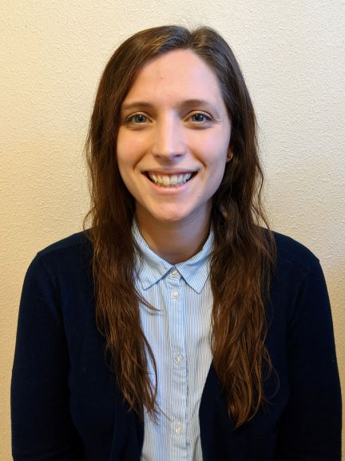
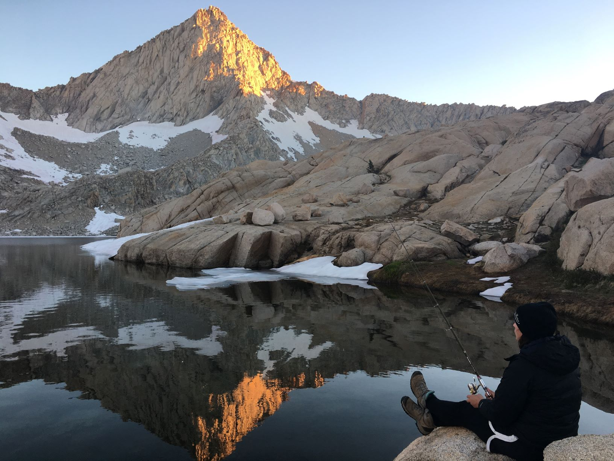

# Welcome!

My name is Ericka. I'm really excited about data literacy and data accessibility. Here you'll find a bit about my background and experience working with data. **For more info you can check out my [LinkedIn](https://www.linkedin.com/in/erickasmithhoward/), or just reach out at <ericka.smith.howard@gmail.com>**

<a href="./downloads/Howard_Ericka_Resume.pdf" download="Howard_Ericka_Resume.pdf">Download My Resume</a>

## What I'm working on right now: 

* I've just been promoted to Data Scientist with The Hartford. We're doing a lot of really interesting work applying machine learning algorithms to business problems! I really enjoy spending my days getting to solve problems and think outside the box.
* Getting into Kaggle Competitions.

## Some of my past projects:

### Shiny apps
* Interactive and Explorative Web-Based Tool for Communication of Large Ensemble Models and Climate Reanalysis Datasets. **We won 2nd Place (Honorable Mention) in this nationwide American Statistical Association contest!** [[shinyapps.io]](https://jimmylovestea.shinyapps.io/datadash/) (Note: This link is SLOW due to the high volume of data.)
* An interactive shiny app for visualizing species distribution data. [[shinyapps.io]](https://erickabsmith.shinyapps.io/catch-data/) (Note: This link is also a little slow due to the size of the data)
* I presented at [Cascadia R Conf 2021](https://cascadiarconf.com/)! Check out my talk on *Addressing Gaps in Data Accessibility with Shiny Dashboards.* [[YouTube]](https://youtu.be/Ze1tobbwb9E)

### Data Analyses
* Local Climate Zone Classification Using Random Forests. [[Project Site]](https://ericka-howard.github.io/masters-project-lcz-classification/) (My master's project!)
* Bootstrapping the Pacific Crest Trail in Parallel. [[Project Site]](https://ericka-howard.github.io/erickahoward-project-trail/)
* A comparison of negative binomial, quasi-Poisson, and Poisson regression of COVID-19 cases. [[Project Site]](https://ericka-howard.github.io/generalized_regression_models/)
* Exploratory Data Analysis and Visualization of Scientific Survey Data. [[GitHub]](https://github.com/ericka-howard/flatfish_2020)

## My story:

Originally from Washington State, I completed my undergraduate degree at Western Washington University in math/biology. I spent quite a few years afterwards in Natural Resources, before returning to school to earn my master's degree in statistics. Now I'm living in Oregon and working remotely as a data scientist. I love hiking, backpacking, scuba diving, and hanging out with my cats. I'd love to chat about anything data, please don't hesitate to [contact me to connect.](mailto:ericka.smith.howard@gmail.com)
